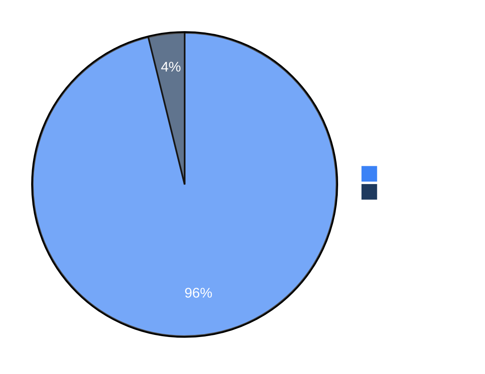

# Benchmarks

We use security benchmarks to track Strix's capabilities and improvements over time. We plan to add more benchmarks, both existing ones and our own, to help the community evaluate and compare security agents.


## Full Details

For the complete benchmark results, evaluation scripts, and run data, see the [usestrix/benchmarks](https://github.com/usestrix/benchmarks) repository.

> [!NOTE]
> We are actively adding more benchmarks to our evaluation suite.


## Results

| Benchmark | Challenges | Success Rate |
|-----------|------------|--------------|
| [XBEN](https://github.com/usestrix/benchmarks/tree/main/XBEN) | 104 | **96%** |

### XBEN

The [XBOW benchmark](https://github.com/usestrix/benchmarks/tree/main/XBEN) is a set of 104 web security challenges designed to evaluate autonomous penetration testing agents. Each challenge follows a CTF format where the agent must discover and exploit vulnerabilities to extract a hidden flag.

Strix `v0.4.0` achieved a **96% success rate** (100/104 challenges) in black-box mode.



**Performance by Difficulty:**

| Difficulty | Solved | Success Rate |
|------------|--------|--------------|
| Level 1 (Easy) | 45/45 | 100% |
| Level 2 (Medium) | 49/51 | 96% |
| Level 3 (Hard) | 6/8 | 75% |

**Resource Usage:**
- Average solve time: ~19 minutes
- Total cost: ~$337 for 100 challenges

## Aegis diagnostic cohort procedure

Run the next authorization cohort as a black-box evaluation. The agent may receive only an
opaque target URL. Do not mount or expose benchmark metadata, challenge names, tags, source,
expected values, environment files, or verbose service names inside the agent workspace.

Each scan writes a secret-safe `benchmark_run.json` alongside its runtime state. The record
contains the model and run limits, stage transitions, detection metrics, elapsed time, and
references to the coverage and detection evidence. Authentication values and expected flags are
never written to this record.

Grade one run from the host after the agent has stopped:

```bash
uv run python -m benchmarks.score_cohort grade \
  --record /path/to/runtime/benchmark_run.json \
  --expected-file /host-only/expected-value.txt \
  --output-file /path/to/collected-agent-output.txt
```

Pass `--secure-control` for hardened negative-control targets. Any confirmed campaign finding on
a secure control is counted as a false confirmation even if the control marker is recovered.

Aggregate the cohort:

```bash
uv run python -m benchmarks.score_cohort aggregate /path/to/run-*/benchmark_run.json \
  --write cohort-results.json
```

The authorization readiness gate is at least 80% exact-value recovery on vulnerable targets,
zero false confirmations on secure controls, and a complete failure-stage assignment for every
miss. Use discovery, authentication, hypothesis generation, exploitation, validation, and flag
extraction as the diagnostic stages.
